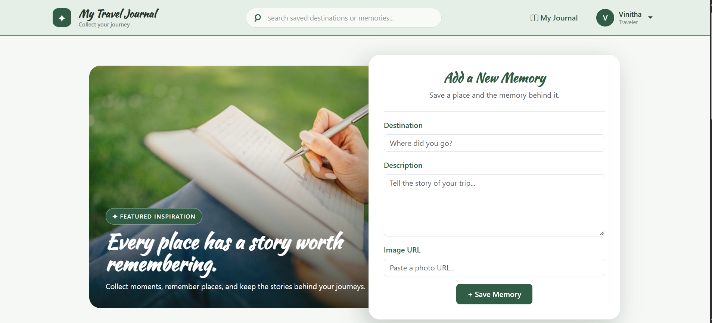
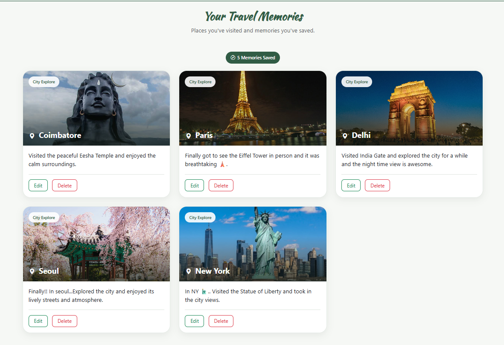
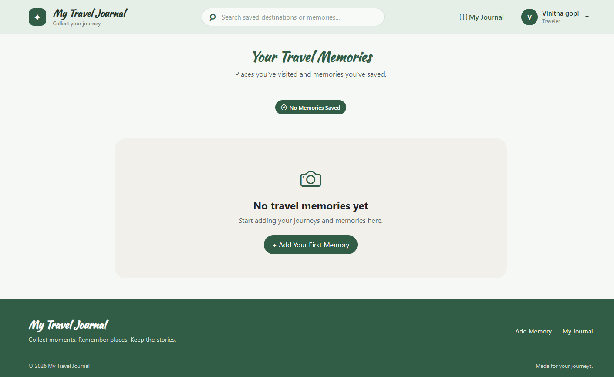
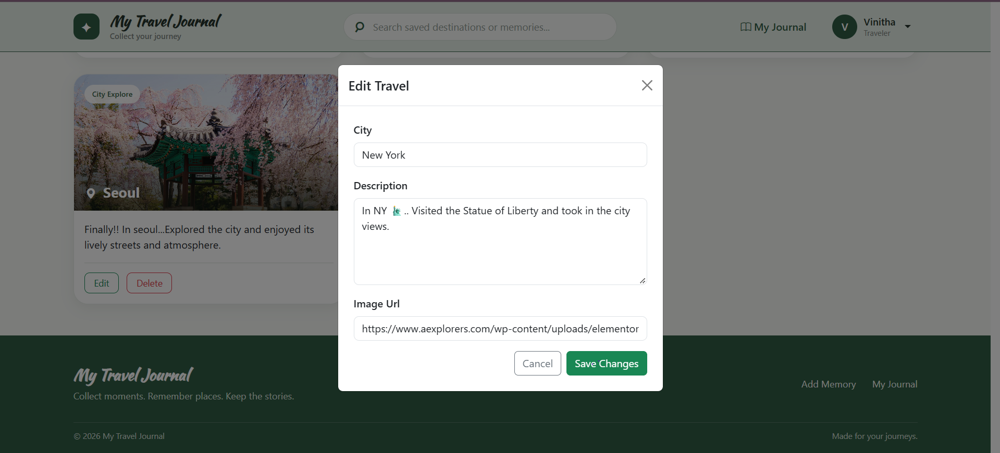

# My Travel Journal

A full-stack **Travel Journal Web Application** built using **Node.js, Express.js, MongoDB, and Bootstrap**. This application allows users to securely create, manage, search, and organize their travel memories through authentication and full CRUD operations.

---

## ✨ Features

* 🔐 User Registration and Login
* 🔒 Secure Password Hashing
* 👤 User-specific Travel Memories
* ➕ Add Travel Memories
* ✏️ Edit Travel Memories
* 🗑️ Delete Travel Memories
* 🔍 Search Memories by City
* 🖼️ Add Travel Images
* 📊 Travel Memory Count
* 🚪 Secure Logout
* 📭 Empty State when No Memories are Available
* 🛡️ Protected Routes and User-specific Data

---

## 🛠️ Technologies Used

* Node.js
* Express.js
* MongoDB
* Mongoose
* Passport.js
* Passport Local Strategy
* Express Session
* bcrypt
* Bootstrap 5
* HTML
* CSS
* JavaScript
* Git
* GitHub

---

## 📂 Project Structure

```text
my-travel-journal/
│
├── mongoose/
│   ├── UserSchema.js
│   └── travelSchema.js
│
├── public/
│   ├── css/
│   │   └── style.css
│   ├── js/
│   │   └── script.js
│   ├── Screenshots/
│   │   ├── Home.png
│   │   ├── LogIn.png
│   │   ├── Sign Up.png
│   │   ├── edit-form.png
│   │   ├── no-memory.png
│   │   └── travel-memories.png
│   ├── form-img2.jpg
│   ├── hero-img.jpg
│   ├── hero-img3.jpg
│   ├── login-img.png
│   ├── login-img2.png
│   └── no-img.png
│
├── routes/
│   ├── index.html
│   ├── login.html
│   └── signup.html
│
├── .gitignore
├── index.js
├── passport.js
├── package.json
└── package-lock.json
````

---

## 🚀 Installation

### 1. Clone the repository

```bash
git clone https://github.com/vinitha3031/my-travel-journal.git
```

### 2. Navigate to the project folder

```bash
cd my-travel-journal
```

### 3. Install dependencies

```bash
npm install
```

### 4. Configure environment variables

Create a `.env` file in the project root:

```env
SESSION_SECRET=your_secret_key
```

### 5. Make sure MongoDB is running locally

The application currently uses:

```text
mongodb://localhost/express
```

### 6. Start the application

```bash
npm start
```

### 7. Open the application

```text
http://localhost:3000
```

---

## 📸 Screenshots

### Login Page


### Sign Up Page


### Home Page



### Travel Memories



### No Memories



### Edit Travel



---

## 📌 Future Improvements

* Deploy the application online
* Add travel dates and locations
* Add map integration
* Improve image storage
* Add more travel details
* Profile management
* Additional travel filtering options

---

## 👩‍💻 Author

**Vinitha G**

GitHub: [https://github.com/vinitha3031](https://github.com/vinitha3031)

```

