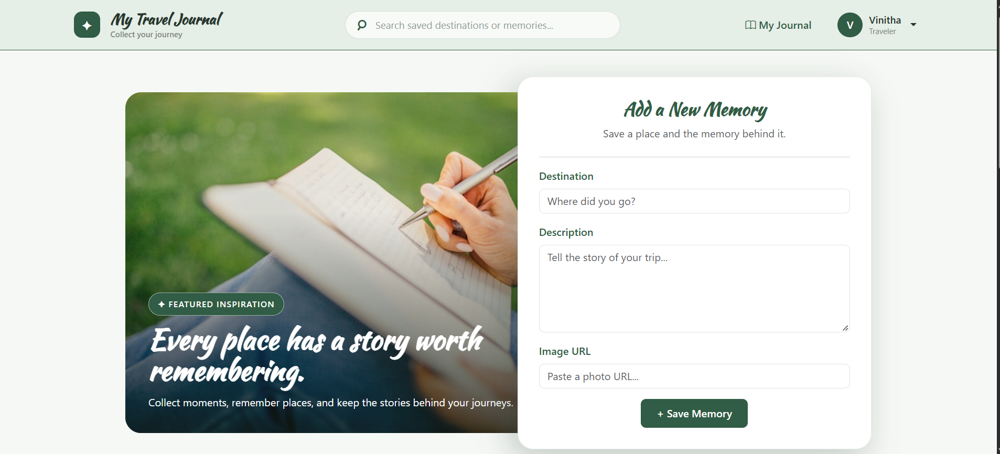
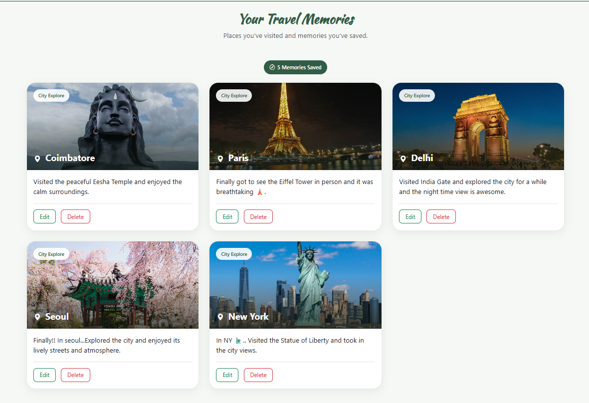
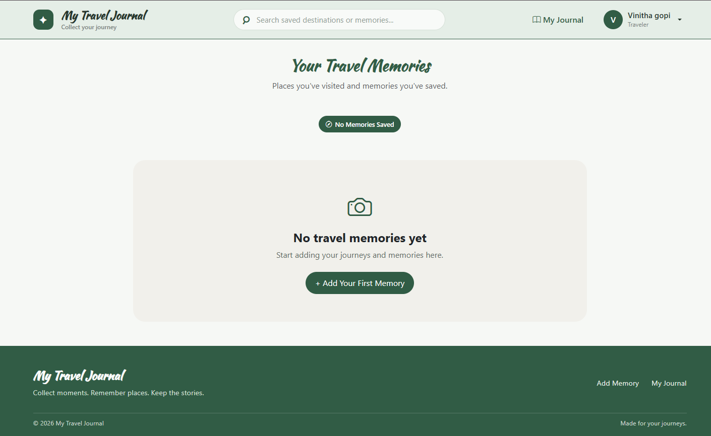
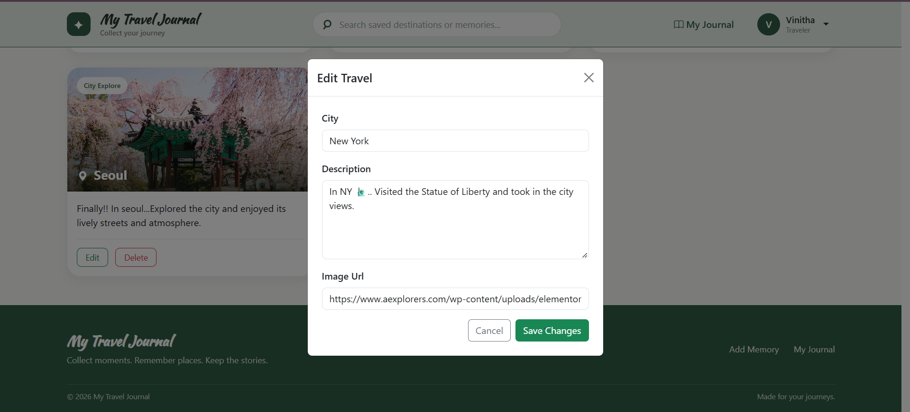

# My Travel Journal

A full-stack **Travel Journal Web Application** built using **Node.js, Express.js, MongoDB, Mongoose, Passport.js, and Bootstrap**.

My Travel Journal allows users to securely create an account, log in, add and manage their travel memories, search saved destinations, and revisit the places and stories they want to remember.

The project also includes a responsive landing page designed to introduce the application and guide visitors toward creating their own travel journal.

---

## ✨ Features

### Landing Page

- 🌍 Responsive travel-focused landing page
- 🖼️ Hero memory carousel
- 🧭 Explore section with travel memories
- ❤️ Interactive memory likes
- 🗺️ About section with visual journey map
- 🔢 How It Works section
- ✈️ Final call-to-action section
- 📱 Responsive mobile navigation
- 🎞️ Scroll and entrance animations
- 🖥️ Responsive desktop, tablet, and mobile layouts

### Authentication

- 🔐 User Registration and Login
- 🔒 Secure Password Hashing
- 🛡️ Protected Routes
- 🚪 Secure Logout
- 👤 User-specific travel memories

### Travel Journal

- ➕ Add Travel Memories
- ✏️ Edit Travel Memories
- 🗑️ Delete Travel Memories
- 🔍 Search Memories by City
- 🖼️ Add Travel Images
- 📊 Travel Memory Count
- 📭 Empty State when No Memories are Available
- 👤 User-specific data and journal content

---

## 🛠️ Technologies Used

- Node.js
- Express.js
- MongoDB
- Mongoose
- Passport.js
- Passport Local Strategy
- Express Session
- bcrypt
- Bootstrap 5
- Bootstrap Icons
- HTML
- CSS
- JavaScript
- Git
- GitHub

---

## 📂 Project Structure

```text
my-travel-journal/
│
├── mongoose/
│   ├── UserSchema.js
│   └── travelSchema.js
│
├── public/
│   ├── css/
│   │   ├── style.css
│   │   ├── landing-hero.css
│   │   ├── landing-explore.css
│   │   ├── landing-about.css
│   │   ├── landing-cta.css
│   │   ├── landing-footer.css
│   │   └── landing-animation.css
│   │
│   ├── js/
│   │   ├── script.js
│   │   ├── landing.js
│   │   └── landing-animation.js
│   │
│   ├── images/
│   │   ├── hero-img.png
│   │   ├── hero-img3.jpg
│   │   ├── Bali.jpg
│   │   ├── effiel-tower.jpg
│   │   ├── seoul.jpg
│   │   └── ...
│   │
│   └── Screenshots/
│       ├── Landing.png
│       ├── Home.png
│       ├── LogIn.png
│       ├── SignUp.png
│       ├── edit-form.png
│       ├── no-memory.png
│       └── travel-memories.png
│
├── routes/
│   ├── index.html
│   ├── login.html
│   └── signup.html
│
├── .gitignore
├── index.js
├── passport.js
├── package.json
└── package-lock.json
```

---

## 🚀 Installation

### 1. Clone the repository

```bash
git clone https://github.com/vinitha3031/my-travel-journal.git
```

### 2. Navigate to the project folder

```bash
cd my-travel-journal
```

### 3. Install dependencies

```bash
npm install
```

### 4. Configure environment variables

Create a `.env` file in the project root:

```env
SESSION_SECRET=your_secret_key
```

### 5. Make sure MongoDB is running locally

The application currently uses:

```text
mongodb://localhost/express
```

### 6. Start the application

```bash
npm start
```

### 7. Open the application

```text
http://localhost:3000
```

---

## 📸 Screenshots

### Landing Home Page


### Login Page


### Sign Up Page


### Journal Page



### Travel Memories



### No Memories



### Edit Travel



---

## 📌 Future Improvements

- Deploy the application online
- Add travel dates and locations
- Add map integration
- Improve image storage
- Add profile management
- Add additional travel filtering options
- Expand travel memory and journal features

---

## 👩‍💻 Author

**Vinitha G**

GitHub:
[https://github.com/vinitha3031](https://github.com/vinitha3031)
